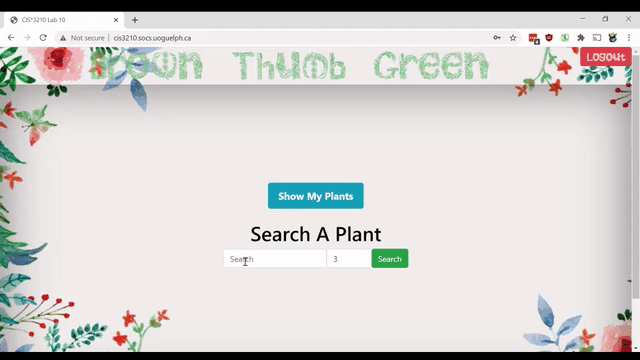

# Brown Thumb Green

This is the lab project I worked on throughout the course of my Networking class. 
This application is a simple webpage with a plant search bar. Each user logs in and tries to search a plant! Then they can save it to their plant list to find out more about it! :)

The Search button attempts to search the name of a plant.
The Show My Plants button shows the user a list of all the plants they've saved. 
The results are unique for each user.

 
